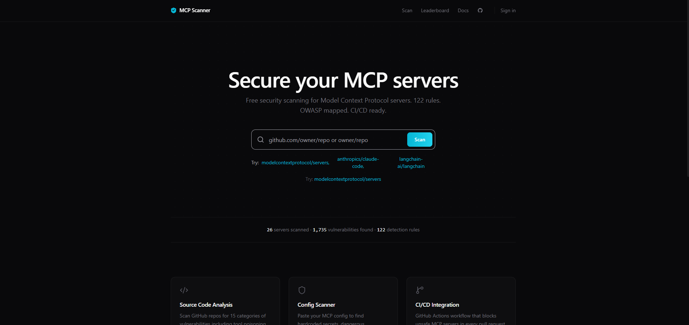

# MCP Scanner

**Security scanner for Model Context Protocol servers**


MCP Scanner analyzes Model Context Protocol server source code for security vulnerabilities. It detects hardcoded credentials, command injection, path traversal, tool poisoning, and 11 other vulnerability categories across 122 detection rules. Every finding is mapped to the OWASP MCP Top 10 with CWE and MITRE ATLAS cross-references. Free to use, no account required.



## Features

- **122 Security Rules** across 15 vulnerability categories
- **OWASP MCP Top 10** — full coverage with CWE and MITRE ATLAS mapping
- **Config Scanner** — paste your `claude_desktop_config.json` to find hardcoded secrets
- **Bulk Scan** — scan up to 20 repositories at once
- **CI/CD Ready** — generate GitHub Actions YAML for automated scanning
- **README Badges** — embeddable security grade badges for your repo
- **Public Leaderboard** — transparent security rankings for MCP servers
- **REST API** — programmatic access to scan results and scores
- **MCPGuard GitHub App** — automatic PR reviews for MCP config changes
- **100% Free** — no limits, no credit card, no catch

## Quick Start

### Scan a server

Visit [mcpscanner.cloud](https://mcpscanner.cloud) and enter a GitHub repository URL.

### Scan your MCP config

```bash
curl -X POST https://mcpscanner.cloud/api/scan/config \
  -H "Content-Type: application/json" \
  -d '{"config": "{\"mcpServers\": {\"my-server\": {\"command\": \"npx\", \"args\": [\"-y\", \"some-mcp-server\"], \"env\": {\"API_KEY\": \"sk-...\"}}}}"}'
```

### Install MCPGuard on your repo

[Install MCPGuard](https://github.com/apps/mcpguard-scanner) — automatic security reviews on every PR that modifies MCP config files.

### Get your security badge

```markdown
[](https://mcpscanner.cloud)
```

## What it detects

| Category | Rules | OWASP | Description |
|----------|-------|-------|-------------|
| Tool Poisoning | 12 | MCP03 | Hidden instructions in tool descriptions |
| Command Injection | 14 | MCP06 | Shell execution with unsanitized input |
| Path Traversal | 10 | MCP06 | Directory escape and unauthorized file access |
| Credential Theft | 12 | MCP01 | Hardcoded API keys, tokens, and secrets |
| SSRF | 8 | MCP06 | Server-side request forgery via URL manipulation |
| Missing Auth | 8 | MCP07 | Endpoints without authentication checks |
| Excessive Permissions | 9 | MCP02 | Overly broad filesystem and network access |
| Supply Chain | 8 | MCP09 | Dependency risks and typosquatting |
| Rug Pull | 8 | MCP09 | Dynamic tool registration and conditional behavior |
| Data Exfiltration | 7 | MCP05 | Sensitive data sent to external endpoints |
| Insecure Communication | 5 | MCP08 | Missing TLS, plain HTTP endpoints |
| Excessive Data Exposure | 6 | MCP05 | Stack traces, verbose errors, debug mode |
| Runtime Tool Poisoning | 5 | MCP04 | Injection via tool return values |
| Shadow MCP Servers | 5 | MCP09 | Undocumented servers and proxy relays |
| Logging Deficiency | 5 | MCP10 | Missing audit trails and security logging |

## API

### Get server score

```bash
GET /api/v1/score/:owner/:repo
```

```json
{
  "server": "owner/repo",
  "grade": "B",
  "score": 78,
  "findings": { "critical": 0, "high": 2, "medium": 3, "low": 1 },
  "lastScanned": "2026-04-06T12:00:00Z",
  "reportUrl": "https://mcpscanner.cloud/report/...",
  "badgeUrl": "https://mcpscanner.cloud/api/badge/owner/repo.svg"
}
```

### Get security badge

```bash
GET /api/badge/:owner/:repo.svg
```

### Scan a repository

```bash
POST /api/scan
Content-Type: application/json

{"repoUrl": "https://github.com/owner/repo"}
```

### Scan MCP config

```bash
POST /api/scan/config
Content-Type: application/json

{"config": "{\"mcpServers\": { ... }}"}
```

### Bulk scan

```bash
POST /api/scan/bulk
Content-Type: application/json

{"repoUrls": ["https://github.com/owner/repo1", "https://github.com/owner/repo2"]}
```

[Full API documentation](https://mcpscanner.cloud/docs)

## MCPGuard — GitHub App

MCPGuard automatically scans pull requests for insecure MCP configuration files. When someone adds or modifies `.vscode/mcp.json`, `.cursor/mcp.json`, `claude_desktop_config.json`, or `.mcp.json`, MCPGuard posts an inline security review with fix suggestions.

**What it catches:**
- Hardcoded API keys (OpenAI, AWS, GitHub, Anthropic, Stripe, Slack, Google, 15+ providers)
- Dangerous commands (shell access, privilege escalation)
- Suspicious packages (typosquatting, known malicious)
- Unpinned dependencies (MCP servers without version locks)

Critical findings trigger `REQUEST_CHANGES` to block the merge. Warnings are posted as comments.

[Install MCPGuard](https://github.com/apps/mcpguard-scanner)

## Grading

Servers receive a letter grade based on scan findings:

| Grade | Score | Meaning |
|-------|-------|---------|
| A | 90–100 | Excellent — minimal risk |
| B | 75–89 | Good — minor issues |
| C | 60–74 | Moderate risk |
| D | 40–59 | High risk |
| F | 0–39 | Critical risk |

Tool poisoning findings cap the grade at D. Critical severity findings cap at C. Confidence levels (high, medium, low) weight the penalty applied to each finding.

## Tech Stack

- **Framework**: Next.js 16 (App Router)
- **Language**: TypeScript
- **Database**: Neon Postgres (Drizzle ORM)
- **Cache**: Upstash Redis
- **Auth**: Clerk
- **Hosting**: Vercel
- **Styling**: Tailwind CSS + Geist font

## Development

```bash
git clone https://github.com/NOTTIBOY137/mcp-scanner.git
cd mcp-scanner
npm install
cp .env.example .env.local
npm run dev
```

Required environment variables: `DATABASE_URL`, `UPSTASH_REDIS_REST_URL`, `UPSTASH_REDIS_REST_TOKEN`, `GITHUB_TOKEN`. See [.env.example](.env.example) for the full list.

## Contributing

We welcome contributions. See [CONTRIBUTING.md](CONTRIBUTING.md) for guidelines.

**Areas where we need help:**
- Adding detection rules for new vulnerability patterns
- Improving false positive reduction with validators
- Testing against more MCP server codebases
- Documentation and examples

## Links

- [Live Scanner](https://mcpscanner.cloud)
- [API Documentation](https://mcpscanner.cloud/docs)
- [MCPGuard GitHub App](https://github.com/apps/mcpguard-scanner)
- [Leaderboard](https://mcpscanner.cloud/leaderboard)

## License

MIT — see [LICENSE](LICENSE) for details.

---

If this tool helped secure your MCP servers, consider giving it a star.
